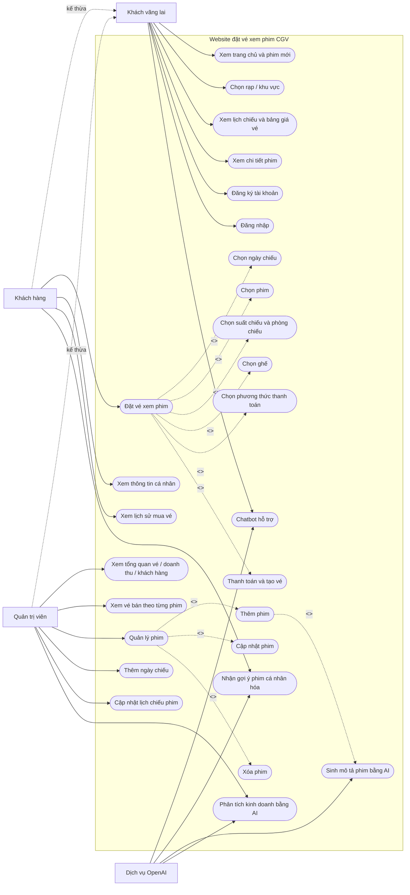

# Use Case - Website đặt vé xem phim CGV

## Giả định khi vẽ

- Sơ đồ dựa trên source hiện tại trong `frontend/src`, `backend/index.js`, `backend/ai/routes.js` và `database/movie_ticket_booking_website.sql`.
- Không vẽ MySQL như một actor vì cơ sở dữ liệu là thành phần nội bộ của hệ thống, không phải tác nhân bên ngoài.
- `AISearchBox` và API `/ai/search` có tồn tại nhưng `ShowtimesPage.jsx` hiện chưa render component này, nên không đưa vào sơ đồ chính.
- UI có nút hủy vé, backend có `/cancelOneTicket`, nhưng frontend đang gọi `/cancelTicket`. Chức năng này chưa khớp endpoint, nên chỉ ghi chú, không đưa vào use case chính.

## Tác nhân

- **Khách vãng lai:** người dùng chưa đăng nhập, có thể xem phim, lịch chiếu, chi tiết phim, đăng ký, đăng nhập và dùng chatbot.
- **Khách hàng:** người dùng có `person_type = Customer`, có thể đặt vé, xem thông tin cá nhân, xem lịch sử mua vé và nhận gợi ý phim.
- **Quản trị viên:** người dùng có `person_type = Admin`, có thể vào trang quản trị, xem thống kê, quản lý phim và lịch chiếu.
- **Dịch vụ OpenAI:** tác nhân phụ phục vụ chatbot, gợi ý phim, sinh mô tả phim và phân tích kinh doanh.

## Sơ đồ use case

## Ghi chú chức năng đang có nhưng chưa nên đưa vào sơ đồ chính

- **Tìm kiếm phim bằng AI:** có `AISearchBox.jsx` và `/ai/search`, nhưng chưa được gắn vào `ShowtimesPage.jsx`.
- **Hủy vé:** có nút hủy vé trong `CustomerInfoSection.jsx`, nhưng endpoint frontend/backend chưa đồng bộ (`/cancelTicket` khác `/cancelOneTicket`).
- **Endpoint `/api/register`:** backend có endpoint này nhưng schema SQL không có bảng `users`, trong khi flow đăng ký thật đang dùng `/registration` và bảng `person`.

## File PlantUML

Nếu cần nộp theo dạng UML chuẩn, dùng file `docs/usecase.puml`.
